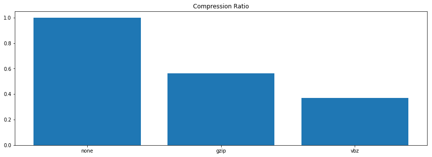
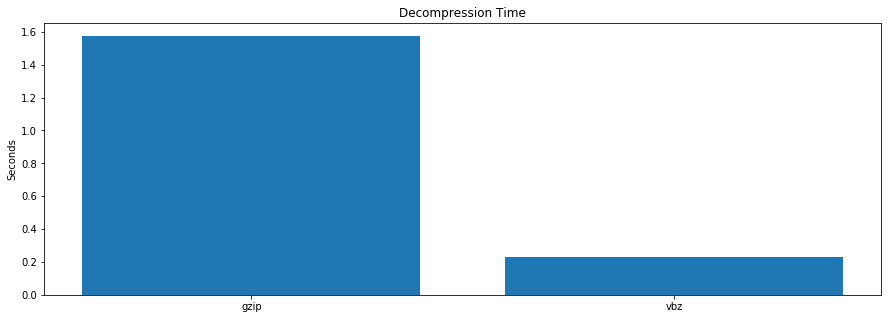

VBZ Compression
===============

VBZ Compression uses variable byte integer encoding to compress nanopore signal data and is built using the following libraries:

  - https://github.com/lemire/streamvbyte
  - https://github.com/facebook/zstd

The performance of VBZ is achieved by taking advantage of the properties of the raw signal and therefore is most effective when applied to the signal dataset. Other datasets you may have in your Fast5 files will not be able to take advantage of the default VBZ settings for compression. VBZ will be used as the default compression scheme in a future release of MinKNOW.

Installation
------------

See the [release](https://github.com/nanoporetech/vbz_compression/releases) section to find the installers for the hdf5 plugin.

Post installation you can then use `HDFView`, `h5repack` or `h5py` as you normally would:

```bash
# Invoke h5repack to pack input.fast5 into output.fast5
#
# The integer values specify how the data is packed:
#   - 32020: The id of the filter to apply (vbz in this case)
#   - 5: The number of following arguments
#   - 0: Filter flag for configuring filter version
#   - 0: Padding value for configuring filter version
#   - 2: Packing integers of size 2 bytes
#   - 1: Use zig zag encoding
#   - 1: Use zstd compression level 1
> h5repack -f UD=32020,5,0,0,2,1,1 input.fast5 output.fast5

# To compress 4 byte unsigned integers (no zig zag) with level 3 zstd you could use:
> h5repack -f UD=32020,5,0,0,4,0,3 input.h5 output.h5

# Invoke h5repack recursively on all reads using 10 processes
> find . -name "*.fast5" | xargs -P 10 -I % h5repack -f UD=32020,5,0,0,2,1,1 % %.vbz

# Invoke h5repack recursively on all reads storing the results inplace using 10 processes
> find . -name "*.fast5" | xargs -P 10 -I % sh -c "h5repack -f UD=32020,5,0,0,2,1,1 % %.vbz && mv %.vbz %"
```

Benchmarks
----------

VBZ outperforms GZIP in both CPU time (>10X compression, >5X decompression) and compression (>30%).






Development
-----------

To develop the plugin without conan you need the following installed:

- cmake 3.11 (https://cmake.org/)

and the following c++ dependencies

- zstd development libraries available to cmake
- hdf5 development libraries available to cmake (required for testing)

The following ubuntu packages provide these libraries:
  - libhdf5-dev
  - libzstd-dev

Then configure the project using:

```bash
> git submodule update --init
> mkdir build
> cd build
> cmake -D CMAKE_BUILD_TYPE=Release -D ENABLE_CONAN=OFF -D ENABLE_PERF_TESTING=OFF -D ENABLE_PYTHON=OFF ..
> make -j
```
